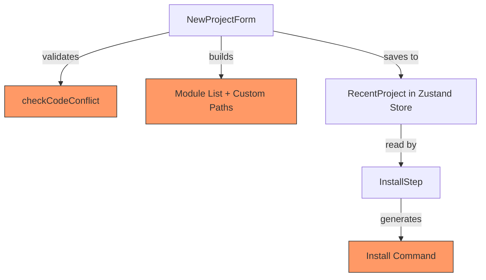

# Design Document: Custom BMM Module Support

## Overview

This feature modifies the New Project Dialog (`NewProjectForm.tsx`) and Install Step (`InstallStep.tsx`) to allow custom modules whose `module.yaml` code matches the primary project type (e.g., `bmm`) to be accepted as replacements rather than rejected as conflicts. Currently, `checkCodeConflict` treats any code collision — including with the primary type — as an error. The fix distinguishes between "replacing the primary module" (allowed) and "duplicating an existing custom/add-on module" (still rejected).

The change is scoped to the conflict validation logic, the module list construction in `handleCreate`, and the install command generation in `InstallStep`. No backend or Electron main-process changes are needed.

## Architecture

The feature touches three layers of the existing architecture:



Components affected:
1. `NewProjectForm.tsx` — conflict validation, module list assembly, UI feedback for replacement
2. `InstallStep.tsx` — install command generation, module chip display
3. `store.ts` / `RecentProject` type — already stores `selectedModules` and `customContentPaths`, no schema change needed

### Design Decisions

- **No new state shape**: The existing `selectedModules` and `customContentPaths` arrays on `RecentProject` and `ProjectWizardState` are sufficient. A custom module that replaces the primary type simply means the primary code is removed from `selectedModules` and the custom path is added to `customContentPaths`.
- **Conflict check split**: Rather than a single boolean `checkCodeConflict`, the logic is split into: (a) is this code the primary type? → allow as replacement, (b) does this code collide with add-ons or other custom modules? → reject.
- **Primary type change handling**: When the user switches primary type, custom modules whose code matched the old primary are retained (they now serve as a replacement for the new primary if codes match, or become regular custom modules if they don't).

## Components and Interfaces

### Modified: `checkCodeConflict(code: string): string | null`

Currently returns a boolean. Changed to return `null` (no conflict) or an error message string, with the following logic:

```typescript
const checkCodeConflict = (code: string): string | null => {
  // Allow custom modules to replace the primary module
  const isPrimaryCode = primaryType !== 'tools' && code === primaryType
  if (isPrimaryCode) {
    // Check if another custom module already replaces the primary
    const alreadyReplaced = customModules.some(m => m.code === primaryType)
    if (alreadyReplaced) {
      return `A custom module already replaces the primary "${primaryType}" module`
    }
    return null // Allowed — this custom module will replace the primary
  }

  // Check against add-on modules and other custom modules
  const allCodes = [...addonModules, ...customModules.map(m => m.code), 'core']
  if (allCodes.includes(code)) {
    return `Module code "${code}" conflicts with an existing module`
  }
  return null
}
```

### Modified: `handleCreate` module list assembly

When a custom module replaces the primary, the primary code is excluded from the `modules` array:

```typescript
// If a custom module replaces the primary, exclude primary from module list
const primaryReplaced = customModules.some(m => m.code === primaryType)
const modules = primaryType === 'tools'
  ? [...addonModules, ...knownCustomModules]
  : [
      ...(primaryReplaced ? [] : [primaryType]),
      ...addonModules,
      ...knownCustomModules.filter(c => c !== primaryType)
    ]

// Custom paths include the replacing module's path
const trueCustomPaths = customModules
  .filter(m => !officialCodes.has(m.code) || m.code === primaryType)
  .map(m => m.path)
```

### Modified: `useEffect` for primary type change cleanup

The existing effect that removes conflicting custom modules on primary type change is updated to retain custom modules whose code matches the new primary (they become replacements):

```typescript
useEffect(() => {
  const reserved = primaryType === 'tools' ? ['core'] : ['core']
  // Note: primaryType is NOT in reserved — custom modules matching it are kept as replacements
  const builtinCodes = new Set([...addonModules, ...reserved])
  setCustomModules(prev => {
    const filtered = prev.filter(m => !builtinCodes.has(m.code))
    return filtered.length === prev.length ? prev : filtered
  })
}, [primaryType, addonModules])
```

### Modified: UI indicator for replacement

A small info alert or chip annotation in the custom modules list when a module replaces the primary:

```tsx
{mod.code === primaryType && primaryType !== 'tools' && (
  <Chip label="Replaces primary" size="small" color="info" variant="outlined" sx={{ ml: 0.5 }} />
)}
```

### Modified: `InstallStep.tsx` — module chip display

The install step already reads `savedModules` and `savedCustomPaths` from the recent project entry. The command generation logic in `buildInstallCommand` already handles these correctly. The only change is to the chip display to show when a custom module replaces the primary:

```tsx
{!modules.includes('bmm') && customContentPaths?.length > 0 && (
  <Chip label="Custom BMM" size="small" sx={{ bgcolor: 'info.main', color: 'white' }} />
)}
```

## Data Models

### No schema changes required

The existing types already support this feature:

```typescript
// RecentProject (store.ts) — already has:
interface RecentProject {
  selectedModules?: string[]      // e.g., ['gds', 'cis'] — primary excluded when replaced
  customContentPaths?: string[]   // e.g., ['/path/to/custom-bmm'] — includes replacing module
}

// ProjectWizardState (projectWizard.ts) — already has:
interface ProjectWizardState {
  selectedModules?: string[]
  customContentPaths?: string[]
}
```

The semantic change is:
- When a custom module replaces `bmm`, `selectedModules` will be `['cis']` (without `bmm`) and `customContentPaths` will include the custom module path.
- When no replacement occurs, behavior is unchanged: `selectedModules` = `['bmm', 'cis']`, `customContentPaths` = `[]`.


## Correctness Properties

*A property is a characteristic or behavior that should hold true across all valid executions of a system — essentially, a formal statement about what the system should do. Properties serve as the bridge between human-readable specifications and machine-verifiable correctness guarantees.*

### Property 1: Primary code match is accepted by conflict validator

*For any* primary type in `{bmm, gds}` and any custom module whose code equals that primary type, if no other custom module with that code already exists, `checkCodeConflict` shall return `null` (no conflict).

**Validates: Requirements 1.1**

### Property 2: Duplicate custom module rejection

*For any* list of existing custom modules and a new custom module, if the new module shares the same code, directory path, or GitHub repository as any existing custom module, the addition shall be rejected with an appropriate error message.

**Validates: Requirements 1.4, 4.1, 4.2, 4.3**

### Property 3: Module list excludes replaced primary

*For any* primary type in `{bmm, gds}` and any set of custom modules where one module's code matches the primary type, the assembled module list shall not contain the primary type code, and the custom content paths shall contain the replacing module's path.

**Validates: Requirements 1.3**

### Property 4: Install command includes primary module if and only if not replaced

*For any* module configuration (primary type, add-on modules, custom modules), the generated install command shall contain `--module <primary>` if and only if no custom module replaces the primary type. When a custom module replaces the primary, the command shall contain `--custom-content <path>` for that module instead.

**Validates: Requirements 2.1, 2.2**

### Property 5: Module configuration round-trip through save and restore

*For any* project creation with a set of selected modules and custom content paths, saving the configuration to a `RecentProject` entry and then reconstructing the install command from that saved data shall produce the same command as the original creation.

**Validates: Requirements 3.1, 3.2**

### Property 6: Primary type change retains matching custom modules

*For any* list of custom modules and any primary type change (including to "tools"), custom modules whose code matches the new primary type shall be retained (as replacements), and custom modules whose code does not conflict with add-on or reserved codes shall also be retained.

**Validates: Requirements 5.1, 5.2**

## Error Handling

| Scenario | Handling |
|---|---|
| Custom module code matches primary and another custom already replaces it | Show error: "A custom module already replaces the primary \<code\> module" |
| Custom module code matches an add-on or other custom module | Show error: "Module code \<code\> conflicts with an existing module" |
| Duplicate directory path | Show error: "This module directory is already added" |
| Duplicate GitHub repository | Show error: "This repository is already added" |
| Invalid custom module (no `module.yaml` or missing code) | Show error from `validateCustomModule` (existing behavior, unchanged) |
| `selectedModules` is undefined on resume | Fall back to `['bmm']` (existing behavior in `InstallStep`) |

All errors are displayed inline via the existing `customModuleError` Alert in `NewProjectForm`. No new error surfaces are needed.

## Testing Strategy

### Unit Tests

Unit tests cover specific examples and edge cases:
- Adding a custom `bmm` module when primary is `bmm` → accepted, module list = `[]` for primary, custom path included
- Adding a custom `bmm` module when primary is `gds` → treated as regular custom module (code doesn't match primary)
- Adding two custom modules with code `bmm` → second rejected
- Switching primary from `bmm` to `gds` with a custom `bmm` module → custom module retained
- Switching primary to `tools` → all custom modules retained
- Install command with replaced primary → no `--module bmm`, has `--custom-content`
- Install command without replacement → has `--module bmm`
- Round-trip: create project config → save to RecentProject → reconstruct command → matches original

### Property-Based Tests

Property-based tests use `fast-check` (already available in the JS/TS ecosystem) with minimum 100 iterations per property. Each test references its design property.

- **Feature: custom-bmm-module-support, Property 1**: Generate random primary types and custom module codes. When code matches primary and no existing replacement, validator returns null.
- **Feature: custom-bmm-module-support, Property 2**: Generate random existing custom module lists and new modules with overlapping code/path/repo. Verify rejection.
- **Feature: custom-bmm-module-support, Property 3**: Generate random primary types and custom module sets with a replacement. Verify module list excludes primary and custom paths include replacement.
- **Feature: custom-bmm-module-support, Property 4**: Generate random module configurations. Verify install command contains `--module <primary>` iff no replacement exists.
- **Feature: custom-bmm-module-support, Property 5**: Generate random module configurations, simulate save/restore, verify command equality.
- **Feature: custom-bmm-module-support, Property 6**: Generate random custom module lists and primary type transitions. Verify no matching custom modules are removed.

Each property test must be tagged with: `Feature: custom-bmm-module-support, Property {N}: {title}`
