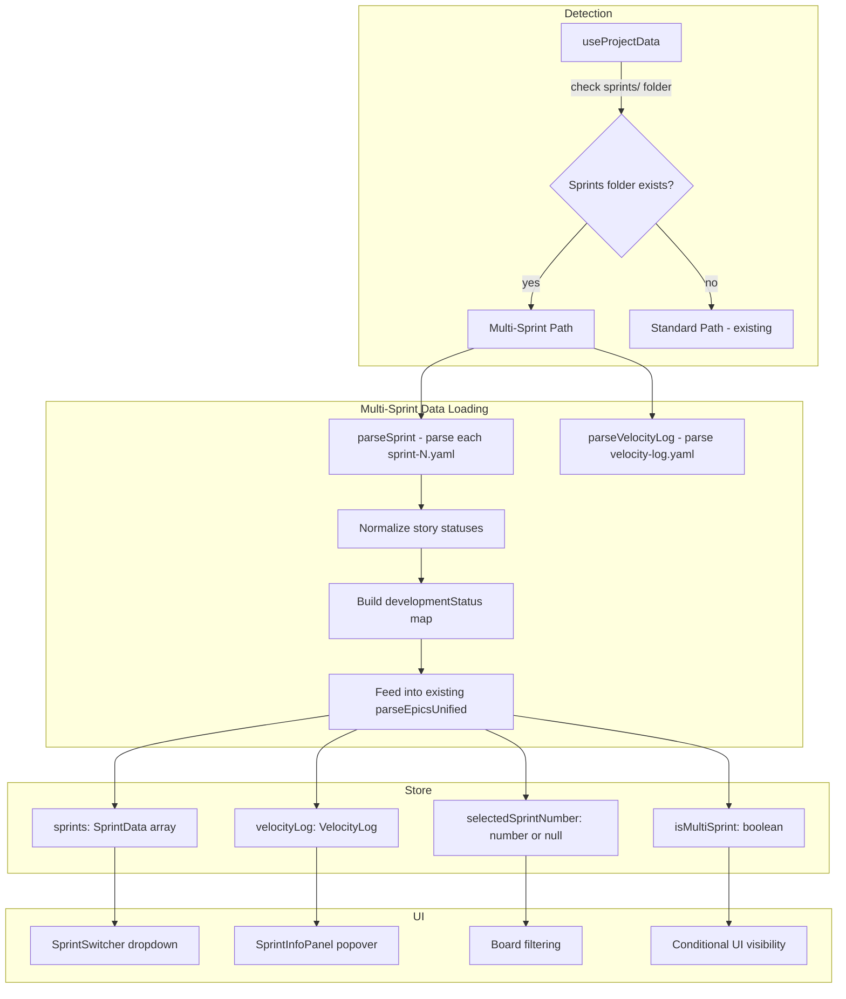
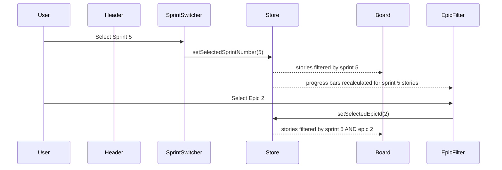

# Design Document: Multi-Sprint Support

## Overview

This design adds multi-sprint awareness to BMad Studio. Projects using `bmad-true-agile` organize work into individual sprint YAML files (`sprint-N.yaml`) in a `sprints/` subfolder rather than a single flat `sprint-status.yaml`. The app needs to detect this structure, parse sprint files (both legacy and current formats), provide a sprint switcher UI, compose sprint filtering with existing epic filtering, and display sprint metrics/velocity data.

The core approach is:
1. Detect multi-sprint projects by checking for the `sprints/` folder during project load
2. Parse all sprint files into a unified data model, deriving story statuses from sprint entries
3. Add a `SprintSwitcher` dropdown to the board toolbar that composes with the existing `EpicFilter`
4. Add a `SprintInfoPanel` popover for viewing sprint metadata and velocity data
5. Extend the Zustand store with sprint state fields, persisted per-project
6. Extend the file watcher to cover the sprints folder

## Architecture



The key architectural decision is to keep the existing data pipeline intact. Sprint files are parsed into the same `developmentStatus` map that `sprint-status.yaml` produces, so `parseEpicsUnified` and the Board component work unchanged. Sprint filtering happens as a pre-filter on the stories array, similar to how epic filtering works today.

## Components and Interfaces

### New Files

**`src/utils/parseSprint.ts`** — Sprint file parser
- `parseSprint(yamlContent: string): SprintData` — Parses a single sprint YAML file, handling both legacy (flat dates) and current (nested dates) formats
- `parseVelocityLog(yamlContent: string): VelocityLog` — Parses velocity-log.yaml
- `buildDevelopmentStatusFromSprints(sprints: SprintData[]): Record<string, StoryStatus>` — Builds the same status map format that `parseSprintStatus` returns, using the most recent sprint's status for each story

**`src/components/SprintSwitcher/SprintSwitcher.tsx`** — Sprint dropdown
- Renders in the board toolbar next to `EpicFilter`
- Shows sprint number, status badge (active/completed), and date range
- "All Sprints" option at top
- Defaults to active sprint on first load

**`src/components/SprintInfoPanel/SprintInfoPanel.tsx`** — Sprint details popover
- Triggered from an info icon next to the sprint switcher
- Shows sprint metadata, team, metrics, stories-by-epic breakdown
- Shows velocity data when available (averages, trend, recommendations)

### Modified Files

**`src/types/index.ts`** — Add sprint-related types

**`src/store.ts`** — Add sprint state fields:
- `sprints: SprintData[]`
- `velocityLog: VelocityLog | null`
- `selectedSprintNumber: number | null` (null = "All Sprints")
- `isMultiSprint: boolean`
- `selectedSprintByProject: Record<string, number | null>` (persisted per-project)
- Setters for each field

**`src/hooks/useProjectData.ts`** — In `loadProjectData()`:
- After determining project type, check for sprints folder
- If found: read all sprint files, parse them, build status map, set `isMultiSprint: true`
- If not found: use existing sprint-status.yaml path, set `isMultiSprint: false`
- Restore persisted sprint selection for the project

**`src/components/Header/Header.tsx`** — Add `SprintSwitcher` next to `EpicFilter` in the bottom toolbar

**`src/components/Board/Board.tsx`** — Add sprint-based story filtering that composes with epic filtering

**`src/components/EpicFilter/EpicFilter.tsx`** — Progress bar calculations should respect the current sprint filter (use filtered stories, not all stories)

**`src/utils/projectTypes.ts`** — Add `getSprintsFullPath()` helper

### Component Interaction



## Data Models

### SprintData

```typescript
interface SprintData {
  sprintNumber: number
  status: 'active' | 'completed' | 'planned'
  dates: {
    start: string       // ISO date string
    targetEnd: string
    actualEnd: string | null
  }
  team: SprintTeamMember[]
  plannedStories: SprintStory[]
  metrics: SprintMetrics
  carryover: SprintStory[]
  retroCompleted: boolean
}

interface SprintTeamMember {
  name: string
}

interface SprintStory {
  key: string           // e.g., "2-12-itokencache-abstraction"
  epic: number
  epicTitle?: string
  title: string
  points: number
  status: string        // raw status from file, normalized later
  assignee: string | null
  jiraKey: string | null
  sourceFile?: string
}

interface SprintMetrics {
  totalPoints: number
  completedPoints: number
  storyCount?: number
  storiesCompleted?: number
  storiesCarried?: number
  storiesByEpic?: Record<string, number>
}
```

### VelocityLog

```typescript
interface VelocityLog {
  sprints: VelocityEntry[]
  averages: {
    last3Sprints: number
    last5Sprints: number
    allTime: number
    trend: string       // "stable", "increasing", "decreasing"
  }
  recommendations: {
    conservative: number
    standard: number
    aggressive: number
  }
}

interface VelocityEntry {
  sprintNumber: number
  plannedPoints: number
  completedPoints: number
  velocity: number
  storiesCompleted: number
  storiesCarried: number
  dateCompleted: string
  notes?: string
}
```

### Store Extensions

```typescript
// New fields in AppState
sprints: SprintData[]
velocityLog: VelocityLog | null
selectedSprintNumber: number | null       // null = "All Sprints"
isMultiSprint: boolean
selectedSprintByProject: Record<string, number | null>  // projectPath -> sprint number

// New setters
setSprints: (sprints: SprintData[]) => void
setVelocityLog: (log: VelocityLog | null) => void
setSelectedSprintNumber: (num: number | null) => void
setIsMultiSprint: (isMulti: boolean) => void
```

The `selectedSprintByProject` map is persisted via the existing electron storage, keyed by project path. When a project loads, the store restores the sprint selection from this map. If the previously selected sprint no longer exists, it falls back to the active sprint or highest-numbered sprint.


## Correctness Properties

*A property is a characteristic or behavior that should hold true across all valid executions of a system — essentially, a formal statement about what the system should do. Properties serve as the bridge between human-readable specifications and machine-verifiable correctness guarantees.*

### Property 1: Multi-sprint detection correctness

*For any* project structure, `isMultiSprint` should be `true` if and only if the sprints folder (`{outputFolder}/implementation-artifacts/sprints/`) exists and contains at least one file matching `sprint-*.yaml`.

**Validates: Requirements 1.1, 1.2, 1.3**

### Property 2: Sprint file round-trip parsing

*For any* valid `SprintData` object (in either nested-dates or flat-dates format), serializing it to YAML and parsing it back with `parseSprint` should produce an equivalent `SprintData` object with all fields preserved (sprint_number, status, dates, team, planned_stories, metrics, carryover).

**Validates: Requirements 2.1, 2.2, 2.3, 2.7**

### Property 3: Velocity log round-trip parsing

*For any* valid `VelocityLog` object, serializing it to YAML and parsing it back with `parseVelocityLog` should produce an equivalent object with all sprint entries, averages, trend, and recommendations preserved.

**Validates: Requirements 2.5**

### Property 4: Sprint story status normalization

*For any* sprint story with a raw status string, the parsed status should be a valid canonical `StoryStatus` value as returned by the existing `normalizeStatus` function. Unrecognized statuses should default to `'backlog'`.

**Validates: Requirements 2.4, 5.4**

### Property 5: Sprint switcher ordering and display

*For any* non-empty list of `SprintData` objects, the sprint switcher should list them in descending order by `sprintNumber`, and each entry should contain the sprint number, status, and date range.

**Validates: Requirements 3.3, 3.4**

### Property 6: Sprint story filtering

*For any* selected sprint number and any set of stories with sprint assignments, the board should display only stories whose keys appear in the selected sprint's `plannedStories` or `carryover` lists.

**Validates: Requirements 3.6**

### Property 7: Default sprint selection

*For any* set of sprints where at least one has `status: 'active'`, the default selected sprint number should be the active sprint's number. If no active sprint exists, the default should be the sprint with the highest `sprintNumber`.

**Validates: Requirements 3.7, 3.8**

### Property 8: Combined sprint and epic filtering is intersection

*For any* sprint selection (including "All Sprints") and any epic selection (including "All Epics"), the stories displayed on the board should be exactly the intersection of stories matching the sprint filter and stories matching the epic filter.

**Validates: Requirements 4.1, 4.2, 4.3**

### Property 9: Epic progress respects sprint filter

*For any* sprint selection, the epic filter progress bars should reflect completion percentages computed only from stories visible under the current sprint selection, not from all stories across all sprints.

**Validates: Requirements 4.4**

### Property 10: Sprint selection preserves epic filter

*For any* current epic filter selection, changing the selected sprint number should not modify the `selectedEpicId` value in the store.

**Validates: Requirements 4.5**

### Property 11: Story status resolution from sprints

*For any* set of sprint files and any story, the resolved status should come from the sprint with the highest `sprintNumber` that contains that story. If the story does not appear in any sprint file, its status should be `'backlog'`.

**Validates: Requirements 5.1, 5.2, 5.3**

### Property 12: Sprint info panel displays all required fields

*For any* `SprintData` object, the sprint info panel should render content containing the sprint number, status, start date, target end date, team members, total points, completed points, and stories grouped by epic.

**Validates: Requirements 6.2, 6.3, 6.4, 6.5**

### Property 13: Velocity display when available

*For any* valid `VelocityLog` object, the sprint info panel should display the last-3-sprint average, last-5-sprint average, all-time average, trend direction, and all three capacity recommendations (conservative, standard, aggressive).

**Validates: Requirements 6.6, 6.7**

### Property 14: Sprint selection persistence round-trip

*For any* project path and selected sprint number, storing the selection in `selectedSprintByProject` and then retrieving it for the same project path should return the same sprint number. After a reload where the selected sprint still exists, the selection should be preserved.

**Validates: Requirements 7.1, 7.3, 7.4**

## Error Handling

| Scenario | Handling |
|---|---|
| Sprints folder missing | Classify as Standard_Project, use existing sprint-status.yaml path. No error shown. |
| Individual sprint file has malformed YAML | Log warning with filename, skip that file, continue loading other sprints. Show degraded data rather than failing entirely. |
| Velocity log missing | Set `velocityLog: null`. Sprint info panel shows sprint metrics without velocity section. |
| Velocity log malformed YAML | Log warning, set `velocityLog: null`. Same graceful degradation as missing. |
| Sprint file has unrecognized story status | `normalizeStatus` returns null → default to `'backlog'`. Existing behavior. |
| Previously selected sprint no longer exists after reload | Fall back to active sprint, or highest-numbered sprint if no active sprint. |
| Empty sprints folder (no sprint-*.yaml files) | Classify as Standard_Project (folder exists but no sprint files). Fall back to sprint-status.yaml. |
| Sprint file missing required fields (sprint_number, planned_stories) | Skip file with warning log. Partial data is worse than no data for that sprint. |

## Testing Strategy

### Unit Tests

- `parseSprint`: Test parsing of both legacy and current format sprint files with known fixtures
- `parseSprint`: Test malformed YAML error handling
- `parseVelocityLog`: Test parsing with known velocity-log.yaml fixture
- `buildDevelopmentStatusFromSprints`: Test carryover resolution with known multi-sprint scenario
- `getDefaultSprintNumber`: Test active sprint selection and highest-number fallback
- Sprint detection: Test with mock filesystem responses (folder exists/doesn't exist, empty folder)
- Combined filtering: Test specific scenarios (sprint+epic, sprint only, epic only, all+all)

### Property-Based Tests

Use `fast-check` as the property-based testing library. Each test should run a minimum of 100 iterations.

Each property test must be tagged with a comment referencing the design property:
- Format: `// Feature: multi-sprint-support, Property N: <property title>`

Property tests to implement:
1. **Sprint file round-trip** (Property 2) — Generate random SprintData, serialize to YAML (both formats), parse, assert equivalence
2. **Velocity log round-trip** (Property 3) — Generate random VelocityLog, serialize, parse, assert equivalence
3. **Status normalization** (Property 4) — Generate random status strings, verify output is always a valid StoryStatus
4. **Sprint ordering** (Property 5) — Generate random sprint arrays, verify descending order by sprintNumber
5. **Sprint filtering** (Property 6) — Generate random stories and sprint assignments, verify filtering correctness
6. **Default sprint selection** (Property 7) — Generate random sprint arrays, verify active sprint or max number is selected
7. **Combined filtering is intersection** (Property 8) — Generate random stories with sprint and epic assignments, verify intersection
8. **Epic progress respects sprint** (Property 9) — Generate random stories across sprints/epics, verify progress calculation
9. **Sprint selection preserves epic filter** (Property 10) — Generate random state transitions, verify epicId unchanged
10. **Story status resolution** (Property 11) — Generate random multi-sprint scenarios with carryover, verify most-recent-sprint resolution
11. **Sprint selection persistence** (Property 14) — Generate random project paths and sprint numbers, verify round-trip through store
