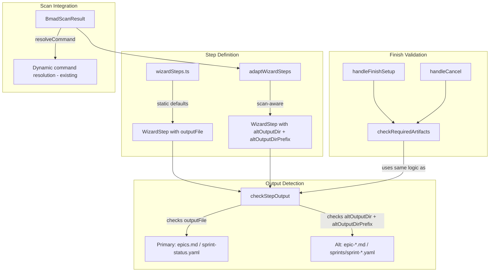
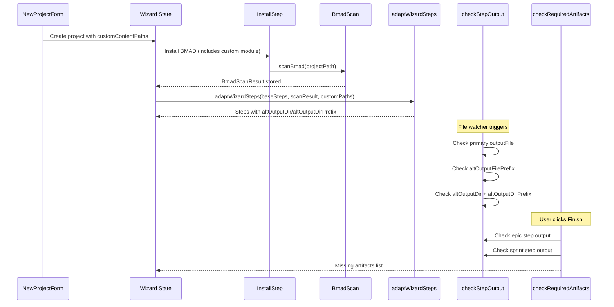

# Design Document: Multi-Sprint Wizard Steps

## Overview

The Project Wizard uses hardcoded `WizardStep` definitions from `wizardSteps.ts` that assume standard BMM output artifacts: `epics.md` for the epic creation step and `sprint-status.yaml` for the sprint planning step. When a custom module (e.g., `bmad-true-agile`) replaces the built-in BMM module, these assumptions break — the custom module may produce sharded `epic-*.md` files and individual `sprint-N.yaml` files in a `sprints/` folder instead.

The wizard already has dynamic command resolution via `resolveCommand` and `bmadScanResult`, but the output file expectations in `checkStepOutput` and the finish validation in `handleFinishSetup`/`handleCancel` are not fully adapted. The epic check in `handleFinishSetup` already has a fallback for `epic-` prefix, but the sprint check does not look in the `sprints/` folder. The `checkStepOutput` function only checks `outputFile`, `outputFilePrefix`, or `outputDir`+`outputDirPrefix` — it has no concept of alternative output locations.

This design extends the wizard step definitions and output detection to support both standard and multi-sprint output structures, using the existing scan infrastructure to determine which output pattern to expect.

## Architecture



### Design Decisions

1. **Extend `WizardStep` with alternative output fields** rather than replacing the existing `outputFile`. The primary `outputFile` remains the standard default; new `altOutputDir` and `altOutputDirPrefix` fields specify an alternative location to check. This is backward-compatible — steps without alt fields behave exactly as before.

2. **Adapt steps after scan completes** via a pure function `adaptWizardSteps(steps, scanResult, customContentPaths)` that returns modified step definitions with alt output fields populated when a custom module is detected. This keeps the static step definitions clean and the adaptation logic testable.

3. **Extract finish validation into a shared function** `checkRequiredArtifacts(projectPath, outputFolder, steps)` used by both `handleFinishSetup` and `handleCancel`. This eliminates the duplicated artifact checking logic and ensures both paths use the same expanded checks.

4. **Detect multi-sprint from scan data** rather than from file system probing. If the scan result contains a workflow whose module matches a custom content path's module and the workflow name differs from the standard `sprint-planning`, or if `customContentPaths` is non-empty, the adaptation function adds alt output fields to the sprint planning step. This avoids async filesystem checks during step definition.

## Components and Interfaces

### New: `adaptWizardSteps` function (in `src/data/wizardSteps.ts`)

Pure function that takes static wizard steps and scan data, returns adapted steps with alternative output fields for custom module projects:

```typescript
function adaptWizardSteps(
  steps: WizardStep[],
  scanResult: BmadScanResult | null,
  customContentPaths?: string[]
): WizardStep[] {
  if (!customContentPaths?.length) return steps
  
  return steps.map(step => {
    // Epic creation step: add alt output for sharded epic files
    if (step.id === 'create-epics-and-stories') {
      return {
        ...step,
        altOutputFilePrefix: 'epic-'
      }
    }
    // Sprint planning step: add alt output for sprints/ folder
    if (step.id === 'sprint-planning') {
      return {
        ...step,
        altOutputDir: 'sprints',
        altOutputDirPrefix: 'sprint-'
      }
    }
    return step
  })
}
```

### New: `checkRequiredArtifacts` function (in `src/components/ProjectWizard/ProjectWizard.tsx` or extracted utility)

Shared validation function used by both `handleFinishSetup` and `handleCancel`:

```typescript
async function checkRequiredArtifacts(
  projectPath: string,
  outputFolder: string,
  steps: WizardStep[]
): Promise<string[]> {
  const missing: string[] = []
  const outputBase = joinPath(projectPath, outputFolder)
  const planningPath = joinPath(outputBase, 'planning-artifacts')
  const implPath = joinPath(outputBase, 'implementation-artifacts')

  // Find epic step and check its outputs (primary + alt)
  const epicStep = steps.find(s => s.id === 'create-epics-and-stories')
  if (epicStep) {
    const found = await checkStepOutput(epicStep, projectPath, outputFolder)
    if (!found.exists) missing.push('epics (run the Epics & Stories step)')
  }

  // Find sprint step and check its outputs (primary + alt)
  const sprintStep = steps.find(s => s.id === 'sprint-planning')
  if (sprintStep) {
    const found = await checkStepOutput(sprintStep, projectPath, outputFolder)
    if (!found.exists) missing.push('sprint planning output (run Sprint Planning)')
  }

  return missing
}
```

### Modified: `WizardStep` type (in `src/types/projectWizard.ts`)

Add alternative output fields:

```typescript
export interface WizardStep {
  // ... existing fields ...
  altOutputFile?: string        // Alternative file to check (e.g., fallback format)
  altOutputFilePrefix?: string  // Alternative file prefix to match (e.g., 'epic-')
  altOutputDir?: string         // Alternative directory to check (e.g., 'sprints')
  altOutputDirPrefix?: string   // Alternative file prefix in alt dir (e.g., 'sprint-')
}
```

### Modified: `checkStepOutput` function

Extended to also check alternative output fields when primary output is not found:

```typescript
async function checkStepOutput(step: WizardStep, projectPath: string, outputFolder: string): Promise<{ exists: boolean; templateWarning: string | null }> {
  // ... existing primary checks (outputFile, outputFilePrefix, outputDir+outputDirPrefix) ...
  
  // If primary not found, check alternative outputs
  if (step.altOutputFilePrefix) {
    for (const dir of searchDirs) {
      if (await window.wizardAPI.checkDirHasPrefix(dir, step.altOutputFilePrefix)) {
        return { exists: true, templateWarning: null }
      }
    }
  }
  if (step.altOutputDir && step.altOutputDirPrefix) {
    for (const dir of searchDirs) {
      if (await window.wizardAPI.checkDirHasPrefix(joinPath(dir, step.altOutputDir), step.altOutputDirPrefix)) {
        return { exists: true, templateWarning: null }
      }
    }
  }
  
  return { exists: false, templateWarning: null }
}
```

### Modified: `ProjectWizard.tsx`

1. Replace the inline `ACTIVE_STEPS` memo with one that calls `adaptWizardSteps`:

```typescript
const ACTIVE_STEPS = useMemo(() => {
  const base = getWizardSteps(primaryModule as 'bmm' | 'gds' | 'dashboard')
  return adaptWizardSteps(base, bmadScanResult, projectWizard.customContentPaths)
}, [primaryModule, bmadScanResult, projectWizard.customContentPaths])
```

2. Replace duplicated artifact checks in `handleFinishSetup` and `handleCancel` with calls to `checkRequiredArtifacts`.

### Modified: `handleFinishSetup`

Replace the inline epic/sprint checking block with:

```typescript
if (finalProjectType !== 'dashboard') {
  const missing = await checkRequiredArtifacts(projectPath, outputFolder, ACTIVE_STEPS)
  if (missing.length > 0) {
    setWizardError('Missing required artifacts:\n' + missing.map(m => '• ' + m).join('\n'))
    return
  }
}
```

### Modified: `handleCancel`

Replace the inline epic/sprint checking block with:

```typescript
if (finalProjectType !== 'dashboard') {
  const missing = await checkRequiredArtifacts(projectPath, outputFolder, ACTIVE_STEPS)
  if (missing.length === 0) {
    // Project is set up — save and clean up
    // ... existing cleanup logic ...
  }
}
```

## Data Models

### WizardStep type extension

```typescript
// Added to existing WizardStep interface in src/types/projectWizard.ts
altOutputFile?: string        // Alternative single file to check
altOutputFilePrefix?: string  // Alternative file prefix to match in search dirs
altOutputDir?: string         // Alternative subdirectory to check within search dirs
altOutputDirPrefix?: string   // Alternative file prefix to match within altOutputDir
```

These fields are only populated by `adaptWizardSteps` when a custom module is detected. For standard BMM projects, they remain `undefined` and `checkStepOutput` behaves exactly as before.

### No store schema changes

The existing `ProjectWizardState.customContentPaths` field already carries the custom module information through the wizard lifecycle. The `BmadScanResult` is already stored in the Zustand store via `bmadScanResult`. No new store fields are needed.

### Data flow




## Correctness Properties

*A property is a characteristic or behavior that should hold true across all valid executions of a system — essentially, a formal statement about what the system should do. Properties serve as the bridge between human-readable specifications and machine-verifiable correctness guarantees.*

### Property 1: Custom module detection from customContentPaths

*For any* wizard initialization with a `customContentPaths` array, `adaptWizardSteps` shall return steps with alternative output fields populated if and only if `customContentPaths` contains at least one path.

**Validates: Requirements 1.1**

### Property 2: Scan-based workflow difference detection

*For any* `BmadScanResult` and standard BMM wizard step, if the scan contains a workflow matching the step's `commandRef` but from a different module than `commandModule`, `resolveCommand` shall return the scan's workflow command rather than the hardcoded default.

**Validates: Requirements 1.2, 2.1, 3.3, 5.1, 5.2**

### Property 3: Epic artifact detection accepts both formats

*For any* file system state and wizard step with `outputFile: 'epics.md'` and `altOutputFilePrefix: 'epic-'`, `checkStepOutput` shall return `{ exists: true }` if either `epics.md` exists in any search directory OR at least one file matching `epic-*` exists in any search directory.

**Validates: Requirements 2.2, 2.3, 4.4**

### Property 4: Sprint artifact detection accepts both formats

*For any* file system state and wizard step with `outputFile: 'sprint-status.yaml'` and `altOutputDir: 'sprints'` + `altOutputDirPrefix: 'sprint-'`, `checkStepOutput` shall return `{ exists: true }` if either `sprint-status.yaml` exists in any search directory OR the `sprints/` subdirectory within any search directory contains at least one file matching `sprint-*`.

**Validates: Requirements 3.1, 3.2, 4.1, 4.2**

### Property 5: Finish validation uses same detection as step completion

*For any* set of adapted wizard steps and file system state, `checkRequiredArtifacts` shall report an artifact as missing if and only if `checkStepOutput` returns `{ exists: false }` for that step. This ensures `handleFinishSetup` and `handleCancel` use identical artifact detection logic.

**Validates: Requirements 4.1, 4.2, 4.3**

### Property 6: Wizard state round-trip preserves custom module info

*For any* `ProjectWizardState` with non-empty `customContentPaths`, serializing the state via `saveState` and deserializing via `loadState` shall produce a state where `customContentPaths` is equal to the original.

**Validates: Requirements 1.3, 6.2, 6.3**

### Property 7: Custom content paths preserved in recent project entry

*For any* project created with `customContentPaths`, the `RecentProject` entry produced by both `handleCreate` (in NewProjectForm) and `handleFinishSetup` (in ProjectWizard) shall contain the same `customContentPaths` array.

**Validates: Requirements 6.1, 6.4**

### Property 8: Step adaptation is idempotent

*For any* set of wizard steps, scan result, and custom content paths, applying `adaptWizardSteps` twice shall produce the same result as applying it once: `adaptWizardSteps(adaptWizardSteps(steps, scan, paths), scan, paths)` equals `adaptWizardSteps(steps, scan, paths)`.

**Validates: Requirements 5.3**

## Error Handling

| Scenario | Handling |
|---|---|
| `customContentPaths` is undefined or empty | `adaptWizardSteps` returns steps unchanged — standard behavior |
| `bmadScanResult` is null (scan not yet complete) | Steps use static defaults; alt output fields not populated until scan completes and `ACTIVE_STEPS` memo recomputes |
| Sprint planning step has no output in either location | `checkRequiredArtifacts` reports it as missing; `handleFinishSetup` shows error with guidance to run Sprint Planning |
| Epic step has no output in either location | `checkRequiredArtifacts` reports it as missing; `handleFinishSetup` shows error with guidance to run Epics & Stories |
| `checkDirHasPrefix` fails (filesystem error) | Existing behavior — returns false, step treated as incomplete |
| Custom module installed but scan returns no workflows | `resolveCommand` returns null for affected steps; wizard shows "Command could not be resolved" alert (existing behavior) |
| Wizard resumed but `customContentPaths` missing from saved state | `adaptWizardSteps` receives undefined, returns steps unchanged — graceful fallback to standard behavior |
| `sprints/` folder exists but contains no `sprint-*.yaml` files | `checkDirHasPrefix` returns false for that directory; step not marked complete |

## Testing Strategy

### Unit Tests

- `adaptWizardSteps`: Returns steps unchanged when `customContentPaths` is empty/undefined
- `adaptWizardSteps`: Adds `altOutputFilePrefix: 'epic-'` to epic step when custom paths present
- `adaptWizardSteps`: Adds `altOutputDir: 'sprints'` and `altOutputDirPrefix: 'sprint-'` to sprint step when custom paths present
- `adaptWizardSteps`: Does not modify steps that aren't epic or sprint steps
- `checkStepOutput`: Returns `exists: true` when `epics.md` exists (standard case)
- `checkStepOutput`: Returns `exists: true` when `epic-1.md` exists but `epics.md` does not (alt case)
- `checkStepOutput`: Returns `exists: true` when `sprints/sprint-1.yaml` exists but `sprint-status.yaml` does not (alt case)
- `checkStepOutput`: Returns `exists: false` when neither primary nor alt outputs exist
- `checkRequiredArtifacts`: Returns empty array when all required artifacts exist
- `checkRequiredArtifacts`: Returns missing items for each missing required artifact
- Integration: Wizard resumes with `customContentPaths` and produces adapted steps

### Property-Based Tests

Use `fast-check` as the property-based testing library. Each test runs a minimum of 100 iterations.

Each property test must be tagged with a comment referencing the design property:
- Format: `// Feature: multi-sprint-wizard-steps, Property {N}: {title}`

Property tests to implement:

1. **Feature: multi-sprint-wizard-steps, Property 1: Custom module detection from customContentPaths** — Generate random arrays of file paths (including empty). Verify `adaptWizardSteps` adds alt fields iff the array is non-empty.

2. **Feature: multi-sprint-wizard-steps, Property 2: Scan-based workflow difference detection** — Generate random `BmadScanResult` objects with varying workflow names and modules. Verify `resolveCommand` returns the scan's command when a match exists.

3. **Feature: multi-sprint-wizard-steps, Property 3: Epic artifact detection accepts both formats** — Generate random file system states (presence/absence of `epics.md` and `epic-*.md` files). Verify `checkStepOutput` returns `exists: true` iff at least one format is present.

4. **Feature: multi-sprint-wizard-steps, Property 4: Sprint artifact detection accepts both formats** — Generate random file system states (presence/absence of `sprint-status.yaml` and `sprints/sprint-*.yaml` files). Verify `checkStepOutput` returns `exists: true` iff at least one format is present.

5. **Feature: multi-sprint-wizard-steps, Property 5: Finish validation uses same detection as step completion** — Generate random adapted step sets and file system states. Verify `checkRequiredArtifacts` missing list matches the set of steps where `checkStepOutput` returns `exists: false`.

6. **Feature: multi-sprint-wizard-steps, Property 6: Wizard state round-trip preserves custom module info** — Generate random `ProjectWizardState` objects with varying `customContentPaths`. Serialize and deserialize, verify `customContentPaths` equality.

7. **Feature: multi-sprint-wizard-steps, Property 7: Custom content paths preserved in recent project entry** — Generate random project configurations with custom paths. Verify the `RecentProject` entry contains the same paths after creation and after finish.

8. **Feature: multi-sprint-wizard-steps, Property 8: Step adaptation is idempotent** — Generate random inputs to `adaptWizardSteps`. Verify `f(f(x)) === f(x)`.
