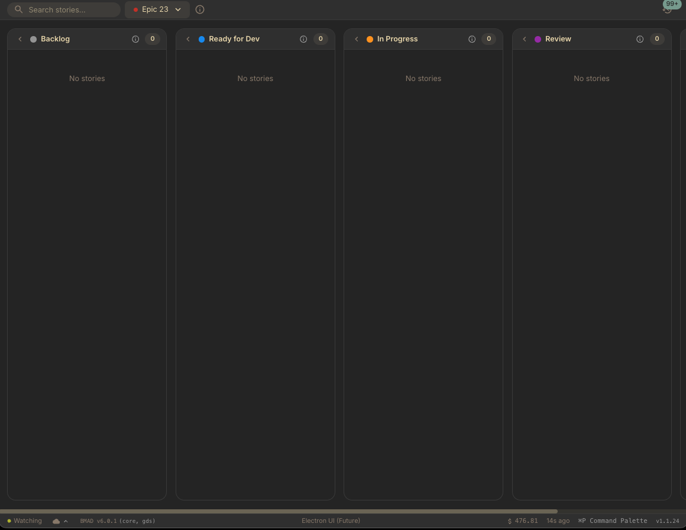

<div align="center">
  
  <p><strong>A web app for viewing and managing BMAD projects — sprint boards, stories, epics, planning artifacts, and multi-sprint support</strong></p>

   
</div>

---



**[Try it live](https://hacking-robot.github.io/bmad-viewer/)**

## Features

### Workflow Dashboard
- **Dashboard View**: Projects without a board module (BMM/GDS) launch into a dedicated dashboard showing all available workflows and agents
- **Module Discovery**: Auto-detects BMAD add-on modules (bmb, cis, tea, etc.) with color-coded module chips
- **One-Click Workflows**: Browse workflows grouped by phase, each showing its assigned agent — click Run to launch directly into chat
- **Agent Cards**: Grid of discovered agents with role descriptions and quick Chat buttons

### Sprint Board
- **Sprint Board**: Drag-and-drop stories across columns (Backlog, Ready for Dev, In Progress, Review, Done, Optional)
- **Multi-Sprint Support**: Switch between sprints with a dedicated sprint switcher; per-project sprint selection is persisted
- **Sprint Info Panel**: View sprint details including date range, velocity metrics, story point totals grouped by epic, and team progress
- **Epic Organization**: Stories grouped by epic with color-coded badges
- **Custom Story Order**: Drag-and-drop ordering within columns, persisted per epic/status
- **Story Details**: View acceptance criteria, tasks, subtasks, and file changes with task toggling
- **Search & Filter**: Find stories by text or filter by epic
- **Collapsible Columns**: Minimize columns with per-epic state persistence
- **Human Review**: Optional review column with configurable checklist items
- **Status History**: Timeline of story status changes with source tracking

### Project Management
- **Project Switcher**: Quickly switch between recent projects (up to 10)
- **BMAD Scanner**: Auto-discovers agents, workflows, and version info from `_bmad/` directory
- **Version Gate**: Blocks usage with pre-BMAD 6 projects and prompts for upgrade
- **Planning Artifacts**: View epics, goals, and planning documents within the app

### Developer Experience
- **100+ Color Themes**: Base24 color schemes with dark/light variants, persisted per-project
- **Command Palette**: Quick actions via `Cmd/Ctrl+K`
- **Keyboard Shortcuts**: Comprehensive shortcuts with `Cmd/Ctrl+/` reference dialog
- **Auto-Refresh**: File watching detects story file changes in real time

## Setting Up a Multi-Sprint Project

BMad Viewer supports multi-sprint projects using the [BMad True Agile](https://github.com/hacking-robot/bmad-true-agile) custom module — a drop-in replacement for the official BMM module with sprint lifecycle workflows.

### Install the True Agile Module

```bash
git clone https://github.com/hacking-robot/bmad-true-agile.git
npx bmad-method install --custom-content ./bmad-true-agile/src
```

When prompted to select modules, **do not select the official `bmm` module** — the True Agile module replaces it.

### How It Works

The True Agile module introduces a full sprint lifecycle. Instead of a single `sprint-status.yaml`, sprint planning generates individual sprint files:

```
_bmad-output/implementation-artifacts/sprints/
├── sprint-1.yaml          # Sprint 1 plan with stories, dates, team, metrics
├── sprint-2.yaml          # Sprint 2 ...
└── velocity-log.yaml      # Optional — velocity tracking across sprints
```

When BMad Viewer detects `sprint-*.yaml` files in the sprints directory, it automatically enables multi-sprint mode with the sprint switcher and sprint info panel.

### Sprint Lifecycle Workflow

```
bmad-sprint-planning          → stories selected, sprint-1.yaml created
  |
  v
Story cycle (per story):
  bmad-create-story           → prepare story detail
  bmad-dev-story              → implement the story
  bmad-code-review            → adversarial review (loop back if issues)
  |
  v
bmad-sprint-review            → close sprint, calculate velocity
bmad-retrospective            → lessons learned at epic end
bmad-sprint-planning          → plan next sprint (loop)
```

### Key Differences from Standard BMM

- **Epics are containers only** — stories are created just-in-time during sprint planning, not during epic creation
- **Deviation detection** — automatically detects drift between PRD/Architecture and the actual codebase
- **Capacity-first planning** — plan sprints based on realistic team capacity
- **Sprint review and retrospectives** — close sprints with velocity tracking
- **Migrate existing projects** — use `bmad-migrate-to-multi-sprint` to convert a single-sprint project

## Compatibility

| Requirement | Supported |
|-------------|-----------|
| BMAD Version | **BMAD 6** |
| Project Types | BMM (BMAD Method), GDS (BMAD Game Dev), Dashboard (module-only) |

## Build from Source

```bash
# Clone the repository
git clone https://github.com/hacking-robot/bmad-viewer.git
cd bmad-viewer

# Install dependencies
npm install

# Run in development mode
npm run dev

# Build for production
npm run build
```

## Usage

1. Open [BMad Viewer](https://hacking-robot.github.io/bmad-viewer/)
2. Select your BMAD or BMAD game project folder
3. View your stories organized by sprint and status
4. Click a story card to view full details
5. Use `Cmd+K` to open the command palette for quick actions

## Tech Stack

- React 18 + TypeScript
- MUI (Material UI) 6
- Zustand for state management
- Vite
- Emotion (CSS-in-JS) with Base24 color themes

## License

MIT
